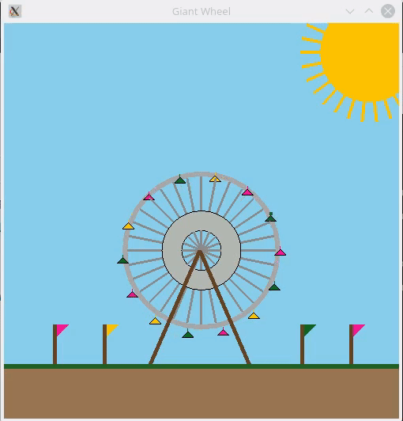

# Giant Wheel using opengl




## Install Opengl

```
   sudo apt-get install g++
   sudo apt-get install freeglut3-dev
   
```

### Compile and run

```
g++ giant_wheel.cpp -lGL -lGLU -lglut
./a.out

```

### References 
- https://www.geeksforgeeks.org/getting-started-with-opengl/
- https://www.youtube.com/watch?v=3aJ8OR1C6pk&list=PLWzp0Bbyy_3jy34HlDrEWlcG3rF99gkvk
- http://freeglut.sourceforge.net/docs/api.php
